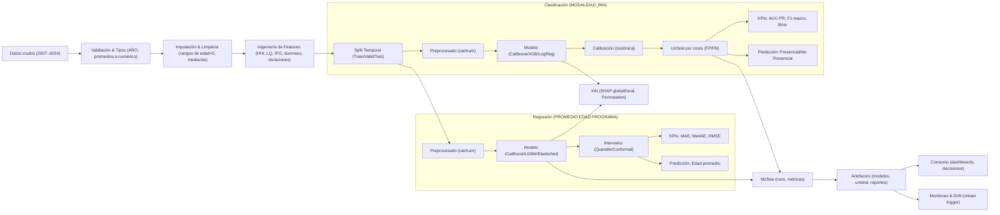
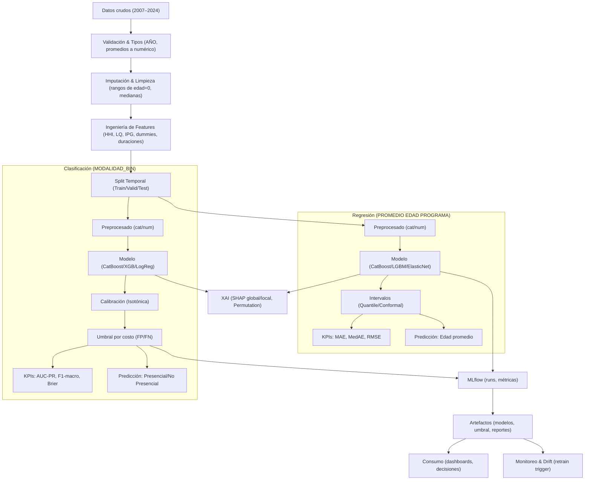

# Propuesta de Proyecto: Modelos Predictivos para la Optimización de la Educación Superior en Chile

---

## 1. Introducción y Contexto Estratégico

El sector de la educación superior en Chile enfrenta un entorno de creciente competitividad y disrupción, donde la capacidad de adaptación y la eficiencia operativa ya no son opcionales, sino un imperativo para la sostenibilidad. En este escenario, la implementación de modelos de *Machine Learning* (ML) y *Deep Learning* (DL) ofrece una palanca estratégica decisiva para transformar datos institucionales en inteligencia accionable. El objetivo de este proyecto es diseñar y validar modelos predictivos robustos para transformar la gestión institucional, optimizar la asignación de recursos y personalizar la oferta académica para asegurar la relevancia y sostenibilidad a largo plazo [4].

Esta propuesta detalla un plan integral para desarrollar dos modelos predictivos clave, abordando tanto un desafío de clasificación como uno de regresión, con el fin de generar valor tangible y una ventaja competitiva sostenible para las instituciones educativas.

## 2. Definición de Objetivos y Alcance del Proyecto

El fundamento de cualquier proyecto de analítica avanzada exitoso reside en la definición precisa de tareas de *Machine Learning* que sean medibles y estén directamente alineadas con los desafíos del negocio educativo. Por ello, este proyecto se centrará en dos tareas específicas, una de clasificación y una de regresión, que abordan problemáticas centrales para la gestión académica y administrativa.

A continuación, se presentan las tareas propuestas, junto con sus variables objetivo y explicativas correspondientes:

### **2.1 Tareas de Machine Learning Propuestas**

| Tarea de ML | Variable Objetivo (Y) | Variables Explicativas (X) |
| --- | --- | --- |
| **Clasificación Binaria** | **MODALIDAD binarizada** (Categoría: Presencial vs. No presencial) | Área CINE, nivel institucional, región/comuna, jornada, duración, tamaño del programa, año, institución. |
| **Regresión** | **PROMEDIO EDAD PROGRAMA** (Valor numérico: edad continua) | Área CINE, modalidad, jornada, duración, región, tipo de plan, año. |

### **2.2 Valor de Negocio de las Tareas Propuestas:**

- **Clasificación (Predicción de Modalidad):** La capacidad de predecir la modalidad de un programa permite una planificación proactiva que reduce costos de infraestructura ociosa. Esta inteligencia impacta directamente en la optimización del CAPEX y OPEX, guiando decisiones sobre la asignación de recursos físicos (aulas, laboratorios) y la contratación estratégica de personal docente con perfiles especializados en enseñanza presencial o virtual.
- **Regresión (Estimación de Edad de Titulación):** Estimar la edad promedio de titulación ofrece *insights* críticos para el diseño curricular y las estrategias de éxito estudiantil. Permite diseñar intervenciones tempranas y personalizadas que han demostrado reducir la deserción estudiantil y mejorar los indicadores de titulación oportuna, adaptando la oferta de servicios de apoyo a los perfiles etarios específicos de cada programa.

Para alcanzar estos objetivos, se seguirá una metodología técnica rigurosa y estructurada, garantizando la calidad y fiabilidad de los resultados.

## 3. Metodología y Enfoque Técnico

Este proyecto se ejecutará siguiendo un ciclo de vida de ML/DL estructurado en cuatro fases clave: Ideación, Preparación, Entrenamiento y Evaluación. Este enfoque, alineado con las mejores prácticas de la industria como CRISP-DM, no solo garantiza la calidad técnica, sino que asegura una alineación continua entre la solución y los objetivos de negocio en cada etapa. Además, permite mitigar proactivamente riesgos técnicos comunes, como la fuga de datos (*data leakage*), que podrían invalidar los resultados.

### 3.1 Fase 1: Ideación y Definición de Métricas de Éxito

Esta fase inicial es crucial, ya que se enfoca en traducir los objetivos de negocio en métricas técnicas cuantificables que reflejen el valor real del proyecto y guíen el desarrollo del modelo. La selección de métricas adecuadas es fundamental para una evaluación honesta del rendimiento.

- **Para Clasificación (Modalidad):** Dado el potencial desbalance entre las clases "Presencial" y "No presencial", la métrica de *Accuracy* puede ser engañosa y ocultar un bajo rendimiento en la clase minoritaria. Por lo tanto, las métricas principales serán:
    - **AUC-PR (Área bajo la curva Precisión-Recall):** Robusta ante el desbalance de clases y enfocada en el rendimiento del modelo sobre la clase de interés.
    - **F1-score (macro):** Calcula la métrica de forma independiente para cada clase y luego promedia los resultados, otorgando el mismo peso a la clase mayoritaria (Presencial) y a la minoritaria (No presencial). Esto es crítico para asegurar que el modelo sea evaluado por su capacidad de identificar correctamente ambas modalidades, y no solo la más frecuente.
- **Para Regresión (Edad):** La métrica principal será:
    - **MAE (Mean Absolute Error):** Se ha seleccionado por su alta interpretabilidad. Al estar expresada en las mismas unidades que la variable objetivo (años), comunica el error promedio del modelo de una manera directa y fácil de entender para todos los *stakeholders*.

### 3.2 Fase 2: Preparación de Datos y Arquitectura del Modelo

Un preprocesamiento de datos meticuloso es la base para asegurar la validez y calidad del entrenamiento del modelo. Esta fase se centrará en transformar los datos crudos en un formato limpio y estructurado.

Los pasos esenciales de preprocesamiento incluyen:

1. **Carga y Validación de Datos:** Se implementará un proceso de carga robusto que verifique la existencia del archivo de datos y maneje de forma flexible distintos tipos de codificación de caracteres (ej. `utf-8`, `latin-1`) para evitar errores de lectura.
2. **Tratamiento de Datos Nulos y Tipos:** Se ha detectado una alta proporción de valores nulos, particularmente en variables de rangos etarios. Se aplicará una estrategia de **imputación** (ej. rellenar con 0 o la media/mediana) para manejar estos datos faltantes. Adicionalmente, columnas relevantes que estén en formato de texto (ej. `PROMEDIO EDAD PROGRAMA`) serán convertidas a un formato numérico adecuado.
3. **Partición Estratégica de Datos:** Se implementará una estrategia de validación dual. Primero, una **validación temporal** (ej. entrenamiento ≤ 2018, prueba 2020-2024)  simulará un escenario de despliegue real, donde el modelo debe predecir el futuro basándose en datos del pasado. Segundo, *dentro* del conjunto de entrenamiento, la **estratificación** será crucial para la tarea de clasificación al crear subconjuntos de validación, garantizando que el modelo aprenda de una distribución de clases representativa durante el ajuste de hiperparámetros.
4. **Escalado de Variables:** Todas las variables numéricas, como la duración de los programas, serán sometidas a un proceso de escalado, como la **estandarización (z-score)** o la **normalización Min-Max**, para asegurar que todas tengan una escala comparable, lo cual es fundamental para el correcto funcionamiento de los algoritmos de redes neuronales.

Para la arquitectura del modelo, dado que el proyecto se basa en **datos tabulares**, la arquitectura de *Deep Learning* más adecuada es el **Perceptrón Multicapa (MLP)**. A diferencia de modelos como las CNNs o RNNs, especializados en datos espaciales o secuenciales, el MLP es la arquitectura canónica y de mayor rendimiento para extraer patrones complejos de datos tabulares heterogéneos como los de este proyecto. El MLP estará compuesto por capas densas de neuronas e incluirá componentes clave como **Batch Normalization**, para mejorar la estabilidad y velocidad del entrenamiento, y **Dropout**, como técnica de regularización para combatir el sobreajuste (*overfitting*).

### 3.3 Fase 3: Entrenamiento y Optimización del Modelo

El objetivo de esta fase es encontrar la configuración óptima de los parámetros (pesos) del modelo MLP para minimizar su función de pérdida y, consecuentemente, maximizar su capacidad predictiva en datos no vistos.

Los mecanismos de aprendizaje fundamentales que se utilizarán son:

- **Descenso del Gradiente:** Este será el algoritmo de **optimización** principal. Funciona ajustando iterativamente los pesos de la red neuronal en la dirección opuesta al gradiente (la pendiente) de la función de error, reduciendo sistemáticamente el error del modelo en cada paso.
- **Backpropagation:** Este algoritmo es el motor del aprendizaje en redes neuronales multicapa. Calcula el error en la capa de salida y lo **propaga hacia atrás** a través de la red, permitiendo una actualización eficiente y coordinada de todos los pesos para minimizar el error global.

Para asegurar que el modelo no solo memorice los datos de entrenamiento sino que también generalice bien a nuevos datos, se implementará una estrategia de regularización de tres capas para asegurar la generalización del modelo: **Dropout** actuará a nivel de neuronas para forzar representaciones robustas, **Weight Decay (L2)** operará a nivel de pesos para controlar la complejidad general del modelo, y **Early Stopping** intervendrá a nivel del proceso de entrenamiento para detenerlo en el punto óptimo de rendimiento.

- **Dropout:** Durante el entrenamiento, se "apagarán" aleatoriamente un porcentaje de neuronas en cada paso, forzando a la red a aprender representaciones más robustas y menos dependientes de neuronas específicas.
- **Weight Decay (L2):** Se añadirá una penalización a la función de pérdida proporcional al cuadrado del valor de los pesos del modelo. Esto desincentiva pesos excesivamente grandes, resultando en un modelo más simple y menos propenso al sobreajuste.
- **Early Stopping:** Se monitoreará continuamente el rendimiento del modelo en un conjunto de datos de validación. El entrenamiento se detendrá automáticamente si la métrica de rendimiento deja de mejorar durante un número determinado de épocas, evitando así el sobreajuste.

Tras la optimización, el proyecto avanzará a la fase final de evaluación rigurosa e interpretación de los resultados.

## 4. Evaluación de Rendimiento y Generación de Valor

La evaluación final del proyecto trasciende la simple medición de la precisión. Se concibe como un análisis integral que validará la fiabilidad predictiva de los modelos, su interpretabilidad para la toma de decisiones y su adecuación ética para ser implementados en el sensible contexto educativo chileno.

### 4.1 Protocolo de Evaluación Rigurosa

Para obtener una medida imparcial y realista de la capacidad de generalización del modelo, la evaluación final de rendimiento se realizará exclusivamente sobre el **conjunto de datos de prueba (*test set*)**, que el modelo no ha visto durante ninguna fase de entrenamiento u optimización.

El plan de evaluación específico para cada tarea es el siguiente:

- **Clasificación (Modalidad):** Además de reportar el AUC-PR y el F1-score, se analizará en detalle la **Matriz de Confusión**, que permitirá cuantificar el trade-off entre Precisión y Recall. En base a este análisis, se definirá un **Umbral Operativo** óptimo que se ajuste a las prioridades del negocio. Por ejemplo, se podrá ajustar el umbral para maximizar el **Recall** de la clase 'No presencial'  si identificar estos programas se considera críticamente importante, incluso a costa de aceptar más falsos positivos.
- **Regresión (Edad):** Se reportará el **MAE** final como principal indicador de rendimiento por su clara interpretabilidad. Este valor se complementará con el **RMSE (Root Mean Squared Error)** si se determina que los errores de gran magnitud (ej. predecir una edad muy lejana a la real) son particularmente costosos o problemáticos desde una perspectiva de negocio.

### 4.2 Interpretabilidad (XAI) para la Toma de Decisiones

Un modelo predictivo es verdaderamente útil solo si sus decisiones pueden ser comprendidas y auditadas. Por ello, la interpretabilidad (XAI, por sus siglas en inglés) es un componente esencial de este proyecto, diseñado para generar confianza en los resultados y extraer *insights* de negocio aplicables en el ámbito educativo.

- **Métodos Aplicados:** Se utilizarán técnicas *post-hoc*, como **SHAP (SHapley Additive exPlanations)** o **Permutation Importance**, que son especialmente adecuadas para los datos tabulares del proyecto. Estos métodos permitirán cuantificar la influencia de cada variable explicativa en las predicciones del modelo.
- **Validación de Hipótesis de Negocio:** La interpretabilidad se usará activamente para testear hipótesis estratégicas. Por ejemplo, se analizará si las áreas de estudio como TIC o Administración y Comercio tienen una influencia predictiva significativamente mayor en la probabilidad de que un programa sea no presencial, especialmente en el periodo post-2020.

### 4.3 Entregables y Consideraciones Éticas

Los entregables finales del proyecto se diseñarán para ser claros, completos y accionables. Incluirán un **informe técnico detallado** que documente la arquitectura final del modelo, las métricas de rendimiento globales y un análisis de desempeño desagregado por subgrupos relevantes (por ejemplo, analizando si existen disparidades de rendimiento entre distintas regiones geográficas del país) para asegurar una visión completa de su comportamiento.

El proyecto se rige por un firme compromiso con la ética y la equidad. Se analizará activamente si el rendimiento del modelo es consistente en diferentes subgrupos para detectar y mitigar posibles sesgos. Todos los riesgos identificados, como la alta nulidad en ciertas variables, y las limitaciones inherentes al modelo serán documentados de forma transparente para asegurar un uso responsable y consciente de sus predicciones.

## 5. Conclusión

Este proyecto no es meramente un ejercicio técnico; es la implementación de un activo estratégico fundamental para la navegación del complejo panorama de la educación superior. La propuesta detalla un plan integral para desarrollar una solución de analítica avanzada que es técnicamente robusta, metodológicamente sólida y éticamente consciente. El resultado no será una simple herramienta, sino la instauración de una capacidad organizacional para la toma de decisiones ágil y basada en evidencia, sentando las bases para optimizar recursos, innovar en el diseño curricular y, en última instancia, fortalecer la excelencia educativa.

## 6. Anexos

---

### 6.1 CSV Titulados
data/raw/TITULADO_2007-2024_web_19_05_2025_E.csv
