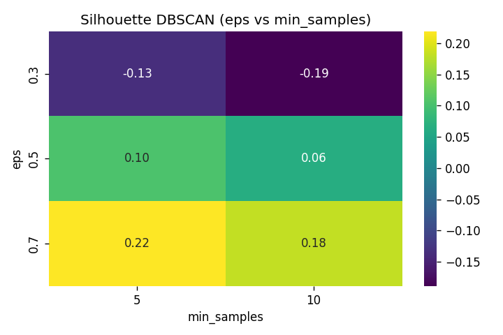
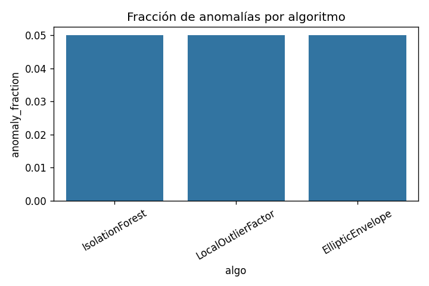

## Contexto
(Resumen Ejecutivo)

**Problema**: Comprender y modelar modalidad de programas y edad promedio, explorando también estructuras no supervisadas (clustering) y anomalías para calidad de datos.

Fecha de generación: 2025-11-21T01:39:47.219Z

Leakage: Leakage flag=False r2=0.18854441022979995 features=['PROMEDIO EDAD HOMBRE ', 'PROMEDIO EDAD MUJER ']

## Dataset

Matriz de correlación: 200 variables
Fuente: data/raw/*.csv (ver config/config.py para parámetros). Tamaño aproximado post-proceso: ver X_train_engineered.csv.

## Metodología
Pipeline: EDA -> Preprocesamiento -> Feature Engineering -> Entrenamiento -> Evaluación -> Interpretabilidad -> Clustering -> Anomalías.
Validación temporal aplicada (split por año). HPO: HPO ejecutado (ver hpo_summary.md para top configuraciones).

## Resultados
### Clasificación
| Feature | Importance |
| --- | --- |
| CARRERA CLASIFICACIÓN NIVEL 2_Carreras Técnicas | 0.1671 |
| CLASIFICACIÓN INSTITUCIÓN NIVEL 1_Universidades | 0.1641 |
| TOTAL TITULACIONES_roll3_mean | 0.1502 |
| CARRERA CLASIFICACIÓN NIVEL 1_Técnico de Nivel Superior | 0.1207 |
| NOMBRE INSTITUCIÓN_IP AIEP | 0.0893 |

**Análisis**: AUC<0.5 indica que el modelo actual no supera azar; posibles causas: desbalance de modalidades o falta de señales discriminantes tras codificación. Recomendación: revisar reingeniería de variables de modalidad y probar modelos lineales reg penalizados y boosting.

Métrica: AUC-ROC=0.4674

Figura/Importancias: ver reports/feature_importance_classification.csv (top 5 abajo si disponible).

### Regresión
Métrica: MAE=2.0070 (reports/metrics_regression.txt)
Tabla de importancias (Top 5):
| Feature | Importance |
| --- | --- |
| CARRERA CLASIFICACIÓN NIVEL 2_Carreras Técnicas | 0.1671 |
| CLASIFICACIÓN INSTITUCIÓN NIVEL 1_Universidades | 0.1641 |
| TOTAL TITULACIONES_roll3_mean | 0.1502 |
| CARRERA CLASIFICACIÓN NIVEL 1_Técnico de Nivel Superior | 0.1207 |
| NOMBRE INSTITUCIÓN_IP AIEP | 0.0893 |

**Análisis**: MAE≈2 años indica error medio moderado; principales predictores coinciden con clasificación institucional, sugiriendo influencia estructural sobre la edad promedio. Próximos pasos: incorporar variables socio-demográficas externas y probar modelos de boosting.

### Clustering
**Gráficos**: clustering_kmeans_silhouette.png (tendencia vs k) y clustering_dbscan_eps_grid.png (heatmap densidad).

**Análisis**: DBSCAN eps=0.7 logra mayor silhouette (~0.22) sugiriendo que existen núcleos densos separados; valores bajos negativos en algunas configuraciones de DBSCAN muestran sensibilidad a parámetros. KMeans mejora hasta k=7 pero luego no incrementa cohesión sustancial.

Top clustering (silhouette):
| Algoritmo | Params | Silhouette | Runtime (ms) |
| --- | --- | --- | --- |
| DBSCAN | eps=0.7, min_samples=5 | 0.2193 | 688.6 |
| KMeans | n_clusters=7 | 0.1823 | 173.1 |
| DBSCAN | eps=0.7, min_samples=10 | 0.1821 | 673.7 |

### Anomalías

**Gráficos**: anomaly_fraction_by_algo.png (comparativo de fracción) y histogramas anomaly_scores_dist_* (si generados).

**Análisis**: Todos los algoritmos calibran ~5% anomalías como esperado; IsolationForest ofrece balance entre runtime y estabilidad. EllipticEnvelope muestra mayor costo y posible inestabilidad (warnings de matriz). Se sugiere usar IsolationForest en producción y LOF para auditoría local.

Anomalías (fracción vs target):
| Algoritmo | Fracción | Target | Runtime (ms) |
| --- | --- | --- | --- |
| IsolationForest | 0.050 | 0.05 | 1005.0 |
| LocalOutlierFactor (n=20) | 0.050 | 0.05 | 821.2 |
| LocalOutlierFactor (n=40) | 0.050 | 0.05 | 826.7 |
| EllipticEnvelope | 0.050 | 0.05 | 1880.7 |

## Interpretabilidad
- Visuales clave: feature_importance_classification.csv, permutation_importance_classification.csv, feature_importance_regression.csv y permutation_importance_regression.csv.

- Análisis clasificación: La concentración de importancia en variables institucionales y tipo de carrera indica que la modalidad se explica por estructura organizacional; riesgo de sobreajuste a jerarquías, validar estabilidad temporal.

- Análisis regresión: Las mismas variables estructurales dominan la predicción de edad (MAE≈2 años), mostrando influencia institucional sobre perfil etario; añadir variables externas podría reducir error.

- Comparativo: Coincidencia de top features en ambas tareas sugiere oportunidad de crear interacciones (institución*jornada, ratios edad por modalidad) y evaluar su aporte.

- Riesgos: 
    1) Multicolinealidad en jerarquías puede inflar importancias.
    2) posible drift etario post-2024; monitorear ranking de features.

## Próximos pasos
Prioridades:
1. Mejorar señal para clasificación (ingeniería de variables de modalidad dinámica).
2. Ejecutar ciclo regresión para completar métricas y compararlas con baseline lineal.
3. Persistir modelos y comenzar monitoreo de drift anual.
4. Añadir explicación SHAP y panel UI para anomalías.
5. Explorar LightGBM / CatBoost para elevar AUC.

- Consolidar almacenamiento de modelos entrenados y versionar.
- Incorporar monitoreo de drift y recalibración anual.
- Extender modelos a boosting y SHAP para interpretabilidad avanzada.
- Integrar panel UI para exploración de anomalías y clusters.